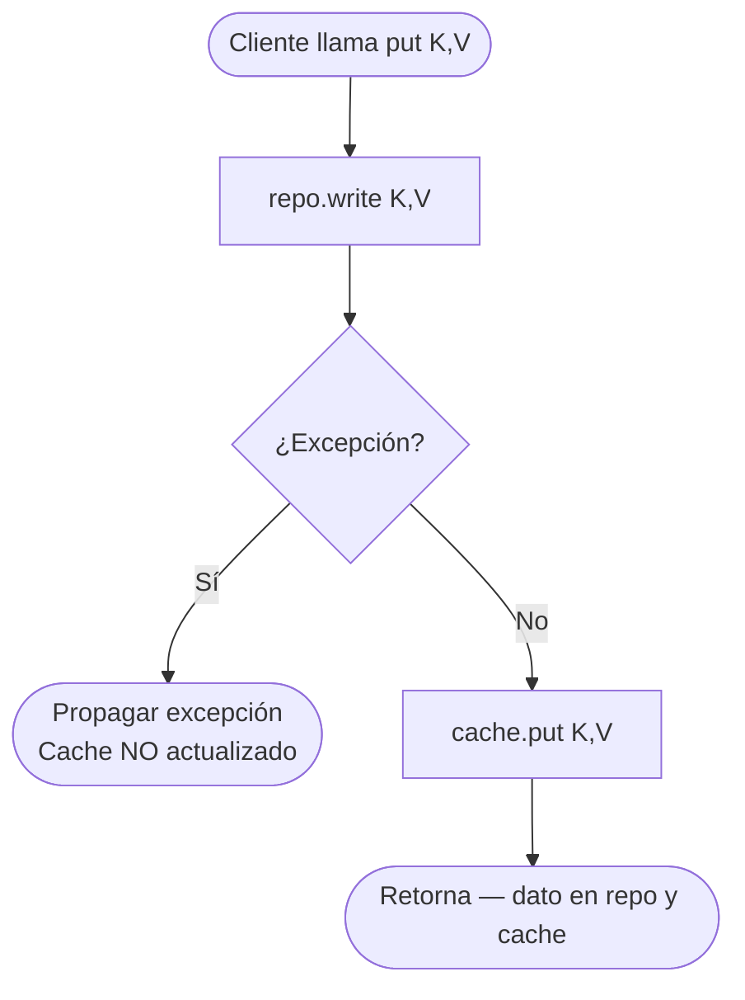
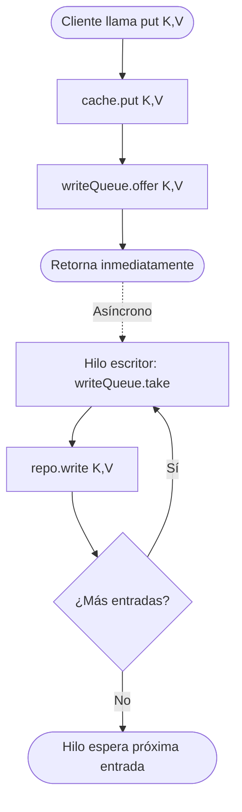

# Caching Lab

Implementación de estrategias de caché en Java 17: LRU, Write-Through, Write-Behind y control optimista de concurrencia.

---

## Resultados JMH — LRUCache vs HashMap directo

| Benchmark              | cacheSize | Throughput (ops/ms) | Error (±)   |
|------------------------|-----------|---------------------|-------------|
| `withCache`            | 100       | 23,691.16           | 184.30      |
| `withCache`            | 1,000     | 18,411.96           | 272.04      |
| `withCache`            | 10,000    | 9,130.57            | 275.48      |
| `withoutCache` (HashMap)| 100      | 161,894.88          | 3,393.18    |
| `withoutCache` (HashMap)| 1,000    | 124,527.51          | 2,521.21    |
| `withoutCache` (HashMap)| 10,000   | 44,222.08           | 17,388.41   |

> Modo: `Throughput`, unidad: `ops/ms`, 25 iteraciones de medición.  
> `withCache` incluye overhead de lock (`ReentrantReadWriteLock`) y mantenimiento de la lista doblemente enlazada.  
> `withoutCache` es solo una lectura directa a `HashMap` sin sincronización.

---

## Write-Through vs Write-Behind

### Tabla comparativa

| Aspecto                  | Write-Through                              | Write-Behind                                  |
|--------------------------|--------------------------------------------|-----------------------------------------------|
| **Latencia de escritura**| Alta — bloquea hasta confirmar repo        | Baja — retorna tras escribir solo en cache    |
| **Consistencia**         | Fuerte — cache y repo siempre sincronizados| Eventual — repo puede estar desactualizado    |
| **Durabilidad**          | Alta — dato persistido antes de retornar   | Baja — riesgo de pérdida si el proceso cae    |
| **Throughput de escritura**| Limitado por velocidad del repo          | Alto — escrituras al repo se agrupan/desacoplan|
| **Complejidad**          | Baja                                       | Media — requiere cola y hilo de flushing      |
| **Riesgo de pérdida**    | Ninguno                                    | Datos en cola no flusheados se pierden        |
| **Casos de uso típicos** | Datos financieros, inventario crítico      | Logs, métricas, sesiones, contadores          |

### ¿Cuándo usar cada estrategia?

**Write-Through** cuando:
- La consistencia entre cache y persistencia es obligatoria.
- El sistema no puede tolerar pérdida de datos (pagos, órdenes).
- Las escrituras son poco frecuentes respecto a las lecturas.

**Write-Behind** cuando:
- La latencia de escritura es crítica para el usuario.
- Se puede tolerar consistencia eventual y pérdida mínima de datos.
- Las escrituras son de alta frecuencia (métricas, eventos, analytics).

---

## Diagramas de flujo — operación `put()`

### Write-Through



### Write-Behind



---

## Estructura del proyecto

```
src/
├── main/java/cache/
│   ├── LRUCache.java
│   ├── CacheRepository.java
│   ├── WriteThroughCache.java
│   ├── WriteBehindCache.java
│   ├── OptimisticStore.java
│   ├── OptimisticLockException.java
│   └── bench/
│       └── CacheBenchmark.java
└── test/java/cache/
    ├── LRUCacheTest.java
    ├── WriteThroughCacheTest.java
    └── OptimisticStoreTest.java
```